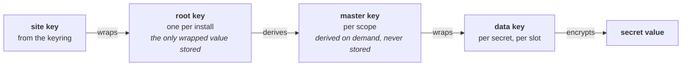

# Secrets API

Feature plugin for the [Secrets API proposed for WordPress 7.2][proposal]. Encrypted, versioned
credential storage with pluggable storage and keyring back ends.

This exists so contributors can *run* the API instead of reading about it, and so sites on 6.6
and later get something usable before the core patch lands. Everything under `src/` is written to
be copied verbatim into `wordpress-develop` — same paths, same coding style, same `default` text
domain.

Once core ships the API, the plugin stands down on its own and says so in an admin notice rather
than shadowing core's implementation.

> **Status: feature plugin, pre-core-merge.** The public API surface is settled — it is the one
> described in the proposal. See [`docs/open-questions.md`](docs/open-questions.md) for what is
> deliberately unresolved.

[proposal]: https://make.wordpress.org/core/2026/08/25/proposal-a-secrets-api-for-wordpress-7-2/

## Clone to green

Two commands. The second brings up wp-env, installs the WordPress test suite inside it, and runs
exactly what CI runs.

```sh
composer install
bin/ci-local.sh
```

Add `--keep` to leave the environment running between iterations.

If you already have a WordPress test suite and a database, skip wp-env entirely:

```sh
make install    # composer install + bin/install-wp-tests.sh
make ci
```

`make ci` is the single source of truth. The CI workflow is a thin wrapper around the same
targets, so a green local run means a green pipeline. Run `make` with no arguments for the full
target list.

| Target | What it does |
|---|---|
| `make lint` / `make lint-fix` | phpcs / phpcbf |
| `make compat` | PHPCompatibilityWP at `testVersion 7.4-` |
| `make analyse` | phpstan |
| `make test` / `make test-ms` | phpunit, single site / multisite |
| `make coverage` | phpunit with an HTML coverage report (see `docs/open-questions.md` re: wp-env) |
| `make ci` | all of the above |

Runners without egress to wordpress.org can point the installer at a mirror with `WP_MIRROR_BASE`
or `WP_TESTS_ZIP_URL`. See [`docs/ci.md`](docs/ci.md).

## What this is

A key hierarchy in which exactly one value is ever stored wrapped:



Rotating the site key re-wraps one value, on a single site or on a 500-site network.

Some things are load-bearing and will not change:

- **Encryption is unconditional.** There is no plaintext mode and no constant to disable it.
- **No filter on the retrieval path.** Nothing intercepts a credential between storage and the
  caller. A filter that can intercept a credential is a filter that can steal one.
- **Fail closed.** An unreachable store or keyring is a `WP_Error`, never a fallback to local
  storage or local key wrapping.
- **No export.** `WP_Secret::reveal()` is the only path to a stored plaintext. Migrations and
  staging pushes mean re-entry at the destination.
- **Three states, never collapsed.** `wp_get_secret()` returns a `WP_Secret`, `null` when the
  secret does not exist, or a `WP_Error` when it exists but could not be retrieved. Absent and
  broken are different things.

### What it is not

There is **no per-plugin isolation**. Namespacing (`plugin-slug/secret-name`) is organisational:
it groups secrets by owner so that listings, and a future admin screen, can be sensible. It is not
an access-control or visibility boundary and was never intended as one. Masking is hygiene against
shoulder-surfing and accidental logging, not a privilege boundary either. **Any plugin that can
run PHP can read any secret.**

There is **no admin settings screen**. The proposal defers it to 7.3. The hooks and accessors a
future screen needs are in scope; the screen is not.

## Requirements

- PHP 7.4+ (core's floor — `src/` contains no PHP 8 syntax)
- WordPress 6.6+
- libsodium, via the extension or core's bundled `sodium_compat`

## Coexisting with the Displace prototype

Some plugins were built against an earlier prototype of this idea. This plugin does not implement
that prototype's API. Instead, a read for a secret that exists only in the prototype's format is
upgraded into the current format the first time it is read, and the prototype's own data is never
touched or deleted. See [`docs/migrating-from-displace.md`](docs/migrating-from-displace.md).

## Host and platform support

Platforms that manage credentials themselves — a KMS-backed store, an HSM, a control panel that is
the system of record — are expressible, and every one of them is *stronger* at rest than the
default. The rule that matters is **stronger than the default, never weaker**: plaintext at rest
stays banned, but "WordPress must be the thing doing the encrypting" was a mechanism standing in
for that property, and it is not the property itself.

`WP_Secrets_Provider` is the extension point that expresses this, and the provider that ships with
WordPress is one implementation of it rather than a privileged case.
[`docs/host-provider-model.md`](docs/host-provider-model.md) has the reasoning, the routing rules,
and what does not flex.

## Extending

Three seams, outermost first:

| Interface | Replaces | Reach for it when |
|---|---|---|
| `WP_Secrets_Provider` | Everything — the platform is the system of record | A control panel, Secrets Manager, or an HSM holds the credential |
| `WP_Secrets_Keyring` | How the root key is wrapped | A KMS holds your keys, but secrets stay in WordPress |
| `WP_Secrets_Store` | Where a record lives | Ciphertext belongs somewhere other than `wp_options` |

The keyring is the one most hosts want, and it is three methods. A `wp-content/secrets.php` drop-in
installs any of them. See [`docs/extending.md`](docs/extending.md) for the contracts and
[`docs/drop-in-example.php`](docs/drop-in-example.php) for a runnable skeleton.

## Platform bindings

[`examples/`](examples/) holds reference implementations for wiring this API to a cloud provider.
Nothing there is loaded by the plugin, and it is excluded from `make ci` so those SDK
dependencies never become this project's. Read its README before writing one — a key-management
service (AWS KMS, Google Cloud KMS) is a `WP_Secrets_Keyring` and takes three methods, while a
secret store (Secrets Manager, Parameter Store) is a `WP_Secrets_Provider` and takes eight.
Choosing the wrong one is the common mistake and it is an expensive one.

## Contributing

Commits are small and logically scoped, and tests land in the same commit as the code they cover.
Before changing anything under `src/`, read the constraints above — several of them are enforced
by architectural tests that read the source, and those tests are never weakened to make a build
green.

CI (`.github/workflows/ci.yml`) is a thin wrapper around the `make` targets above, running on
github.com's hosted runners: static analysis gates a PHP 7.4/8.0/8.3 × WordPress latest/trunk
matrix plus a multisite job. See [`docs/ci.md`](docs/ci.md).

## License

[GPL-2.0-or-later](LICENSE)
