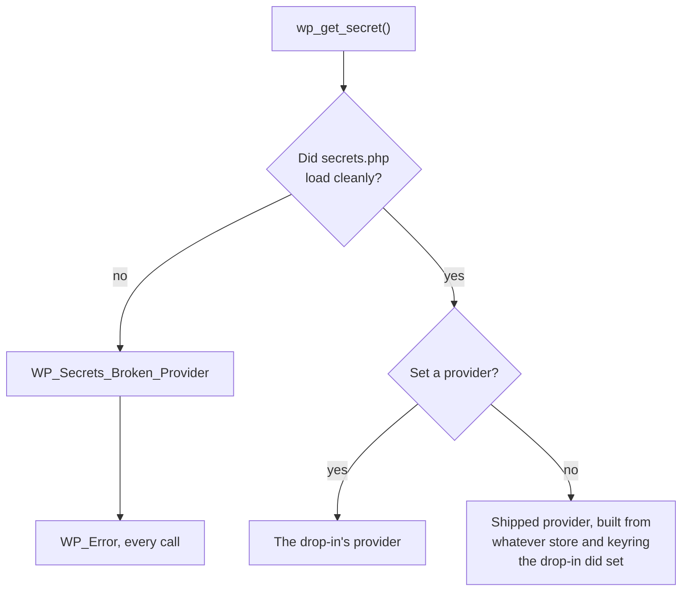

# ADR 0007: Fail closed on a broken drop-in

| | |
|---|---|
| **Number** | 0007 |
| **Date** | 2026-08-27 |
| **Status** | Accepted |

## Context

A `wp-content/secrets.php` drop-in may throw, contain a syntax error, or set one of the
`wp_secrets_provider`, `wp_secrets_store`, or `wp_secrets_keyring` globals to something that does
not implement the matching interface. The obvious recovery is to fall back to the provider
WordPress ships.

That recovery is the failure. A site whose credentials are held on a platform would start
answering from `wp_options`, find nothing there, and report every credential as absent when it is
only unreachable. That is how a rotation gets lost, or how someone regenerates a credential they
still had. [ADR 0001](0001-provider-as-outermost-extension-point.md) made the provider the
outermost extension point; this record covers how one is selected.

## Decision

Exactly one provider serves a request. It is selected once, declaratively, and never mixed with
another.

A drop-in that registers no provider is working as intended: swapping only the keyring is the most
common integration. What counts as broken is an override that is present and wrong. Every read
and write then returns `WP_Error` through `WP_Secrets_Broken_Provider`, `WP_Secrets_Broken_Store`, or
`WP_Secrets_Broken_Keyring`. Nothing falls back to the default. The same rule was extended to a
provider global of the wrong type on 2026-09-04.

## Consequences

- Misconfiguration surfaces as unreachable, never as absent. The three-state return holds even
  when the backend is the thing that broke.
- Site Health and `wp secret dropin` report a broken drop-in explicitly, so the failure is visible
  rather than inferred from missing credentials.
- One gap remains. PHP treats a class that implements an interface but omits a method as an
  uncatchable fatal, even inside the `try`/`catch` around the `require`. A drop-in should be
  checked with `php -l` and a real request before it is trusted in production.
