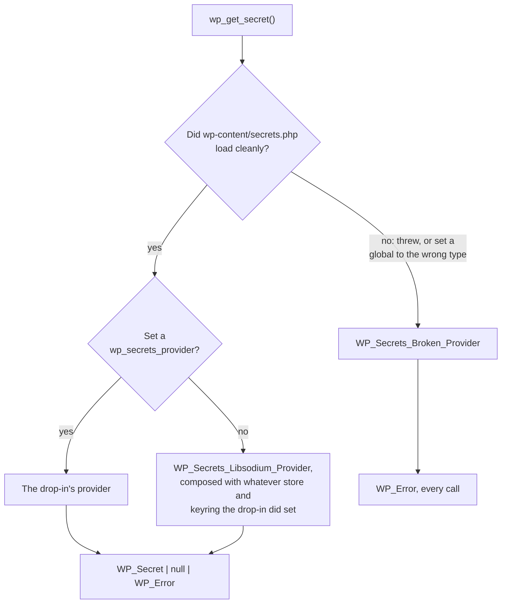

# The host-provider model

How a hosting platform takes over custody of a site's credentials, and why the extension point is
shaped the way it is.

This started as a response to a question the proposal asked:

> Providers are meant to cover what a filter would normally give you — is that substitution
> sufficient for the cases you'd actually need to hook?

Hosts answered "not quite," and they were right. What follows is the resulting design, which is
implemented: `WP_Secrets_Provider` is the outermost extension point, and the public functions
route through it.

## What hosts asked for

| | Who holds the credential | Who encrypts it | Writes | Can WordPress read the value? |
|---|---|---|---|---|
| **Default (self-hosted)** | WordPress, in `wp_options` | WordPress | `wp_set_secret()` | Yes |
| **Pantheon** (Chris Reynolds) | The platform | The platform | Platform tooling | Yes, over an authenticated channel |
| **Altis** (Ryan McCue / Rafael Meneses) | KMS-backed store | The KMS | Host tooling; store is read-only to WP | Yes |
| **Control-panel model** | A platform dashboard | The platform, often an HSM | Dashboard only | Yes, at runtime |

Every arrangement below the first is *stronger* at rest than the default, and not one of them
could be expressed by the original two-seam design.

## Why the original contract blocked them

The proposal says of the two drop-in extension points:

> Neither is ever handed a plaintext secret, and neither can turn encryption off.

That sentence does two jobs, and only one of them is load-bearing:

1. **Encryption cannot be turned off.** Non-negotiable. This is what stops the API degrading into
   the plaintext-in-`wp_options` situation it exists to end.
2. **The store never sees plaintext.** This is *one implementation* of (1), not (1) itself.

Rafael Meneses (Altis) put the correction better than I can paraphrase it:

> A provider can be stronger than the default, never weaker. Plaintext storage stays banned… and
> the setups Ryan and Chris describe stop being banned with it.

That is the whole fix. Replace "never handed plaintext" — a mechanism — with **"never weaker than
the default"** — the actual property. Plaintext-at-rest stays banned. An HSM that receives a value
over an authenticated channel and never writes it to disk is not weaker than an authenticated
libsodium envelope in `wp_options`; it is the thing `wp_options` was a poor substitute for.

To be clear about intent: the platform arrangements were never *meant* to be excluded. The goal
was always a secure default with more-secure upgrade paths available. The two-seam design (store +
keyring) described WordPress's own envelope so precisely that it left no room to say "something
else protects this, and protects it better." That was a design accident, and the fix is to make
the provider the seam rather than to carve exceptions into the store contract.

## What must not flex

Stating these first, because "we relaxed the guarantee" is a sentence that should come with fences:

- **The default path is unchanged.** No drop-in, no platform: encryption is unconditional, there
  is no constant to disable it, and nothing is handed a plaintext.
- **Plaintext at rest in the database stays impossible.** The shipped store never sees a plaintext
  and never will.
- **No filter on the retrieval path.** A provider is a *swap*, not a hook. This distinction is the
  proposal's own and it survives intact: you replace the component, you do not intercept the value
  on its way past.
- **Fail closed.** A provider that cannot answer returns `WP_Error`. It never falls through to a
  weaker source, and WordPress never "helpfully" answers from somewhere else.
- **The three-state contract.** `WP_Secret|null|WP_Error`, never collapsed, regardless of who
  answered.

## How routing works

Exactly one provider serves a request. It is selected once, declaratively, and never mixed with
another:

Note the `no` branch out of the second decision: **registering no provider is a supported
arrangement, not a broken one.** A drop-in that swaps only the keyring — the smallest and most
common integration — leaves the provider global untouched and gets the shipped provider composed
with its keyring. Absence of an override is not a failure.

What *is* a failure is an override that is present and wrong: a drop-in that throws, or that sets
`wp_secrets_provider`, `wp_secrets_store`, or `wp_secrets_keyring` to something that does not
implement the matching interface. Then every call returns `WP_Error` — **not** a quiet fall-back to
the default provider. Falling back would mean a site whose platform integration broke starts
answering from a different credential store, where the credentials do not exist, reporting them
*absent* rather than *unreachable*. That is the exact collapse the three-state contract exists to
prevent, and it is how a rotation gets lost or a stale credential gets served forever.

The shipped provider is one implementation of the interface, not the privileged case others must
be reconciled with. A KMS, an HSM, or a control panel is a peer.

`WP_Secrets_Store` and `WP_Secrets_Keyring` remain, and remain public, but their scope is honest:
they are the composable internals of the *libsodium provider*, not universal concepts. A host that
wants KMS key-wrapping with default storage swaps the keyring inside the default provider rather
than implementing a provider from scratch — three methods instead of eight. See
[`../examples/README.md`](../examples/README.md) for picking the right seam.

## The interface

Eight methods, in `src/wp-includes/interface-wp-secrets-provider.php`:

| Method | Purpose |
|---|---|
| `get( $name, $version, $network )` | `WP_Secret`, `null` for absent, `WP_Error` for unreachable |
| `set( $name, $value, $network, $needs_rotation, $action )` | Write; `WP_SECRETS_ERROR_PROVIDER_READ_ONLY` if not writable |
| `delete( $name, $network )` | Succeeds when the secret was already absent |
| `retire_previous( $name, $network )` | Clears the previous slot; may be a successful no-op |
| `list_secrets( $name_prefix, $network )` | Metadata only — never a value |
| `get_label()` | "What is protecting my credentials?" — for Site Health |
| `get_protection_boundary()` | `BOUNDARY_WORDPRESS` or `BOUNDARY_PROVIDER` |
| `is_writable()` | So a settings screen can disable Save before an operator types a credential |

The last three replace what was originally a stringly-typed `supports()` flag bolted onto the
store contract. Each answers a question someone actually asked.

Enforcement stays where it belongs: a provider that cannot accept a write returns
`WP_SECRETS_ERROR_PROVIDER_READ_ONLY` from `set()`. The declarations are for humans and
interfaces, never a substitute for the check.

### Being honest about what WordPress can verify

Almost nothing, and the design should say so rather than implying otherwise.

A drop-in is already fully trusted code — it runs before plugins and can implement the keyring. A
drop-in that wanted to exfiltrate secrets can do that today, with or without this design. So the
"never handed plaintext" rule was never a sandbox around a hostile drop-in. It was a guard rail
against a *careless* one, and against the API's shape encouraging bad patterns.

`get_protection_boundary()` is therefore **not a security control**. Its value is entirely in being
explicit and visible: a human reviewing a drop-in can see what it claims, Site Health can tell an
operator where their credentials are actually protected, and a plugin author can find out *before*
writing a credential that this site's provider will refuse the write. It is documentation with a
return type, and the docblock says so.

### `reveal(): string|WP_Error`

`WP_Secret::reveal()` can return a `WP_Error`, and `WP_Secret::withheld( $name, $fingerprint,
$reason )` constructs a secret a provider can name and fingerprint but will not release to PHP —
a broker-held or use-only credential, such as an HSM key that signs but never exports.

Everything else about such a secret behaves normally: it lists, it reports a stable fingerprint,
and it masks itself in every output path. `wp secret get` reports the value as withheld rather
than halting, because that command is also how an operator checks whether a secret exists.

This does not arise for the shipped provider, which decrypts eagerly and always has a value in
hand. It is in the signature because a return type cannot be widened after adoption — and it was
worth calling out explicitly rather than slipping in, since `reveal(): string` was published.

## For implementers

Two rules that are easy to get wrong, both enforced by the conformance suite:

- **Absence is `null`, unreachability is `WP_Error`.** A network blip must never look like a
  deleted credential. This is the single property the whole three-state contract exists to protect
   — because "the credential is gone" is how someone gets talked into regenerating one they still
  had.
- **Never cache a plaintext in the persistent object cache.** A provider that calls a platform API
  on every read will be tempted to. The test suite asserts that a `WP_Secret` cannot round-trip a
  plaintext through `wp_cache_set()`, and a provider caching the raw value behind WordPress's back
  would quietly undo that. Request-scoped memoisation only.

A provider backed by a platform system of record should also not persist a copy locally: the
dashboard or KMS is authoritative, and a shadow copy in `wp_options` defeats the point.

Run the conformance suite before trusting an implementation — see
[`extending.md`](extending.md) and [`../examples/README.md`](../examples/README.md).
