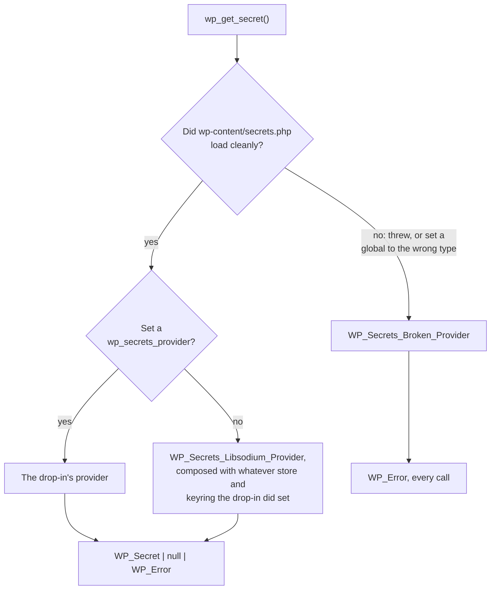

# The host-provider model

How a hosting platform takes over custody of a site's credentials, and why the extension point is
shaped the way it is.

This started as a response to a question the proposal asked:

> Providers are meant to cover what a filter would normally give you — is that substitution
> sufficient for the cases you'd actually need to hook?

Hosts answered "not quite," and they were right. What follows is the design that came out of it,
now implemented: `WP_Secrets_Provider` is the outermost extension point, and the public functions
route through it.

## What hosts asked for

| | Who holds the credential | Who encrypts it | Writes | Can WordPress read the value? |
|---|---|---|---|---|
| **Default (self-hosted)** | WordPress, in `wp_options` | WordPress | `wp_set_secret()` | Yes |
| **Pantheon** (Chris Reynolds) | The platform | The platform | Platform tooling | Yes, over an authenticated channel |
| **Altis** (Ryan McCue / Rafael Meneses) | KMS-backed store | The KMS | Host tooling; store is read-only to WP | Yes |
| **Control-panel model** | A platform dashboard | The platform, often an HSM | Dashboard only | Yes, at runtime |

Every arrangement below the first protects a credential better at rest than the default does, and
the original two-interface design couldn't express any of them.

## Why the original contract blocked them

The proposal says of the two drop-in extension points:

> Neither is ever handed a plaintext secret, and neither can turn encryption off.

That sentence does two separate jobs, and only the first one matters:

1. **Encryption cannot be turned off.** Non-negotiable. It's what stops the API degrading back
   into the plaintext-in-`wp_options` situation it exists to end.
2. **The store never sees plaintext.** That's one way of achieving the first, not the first
   itself.

Rafael Meneses (Altis) put the correction better than I can paraphrase it:

> A provider can be stronger than the default, never weaker. Plaintext storage stays banned… and
> the setups Ryan and Chris describe stop being banned with it.

That's the fix. The rule becomes **"never weaker than the default"** instead of "never handed
plaintext". Plaintext at rest is still banned. An HSM that takes a value over an authenticated
channel and never writes it to disk isn't weaker than an authenticated libsodium envelope in
`wp_options`; it's stronger, and closer to what anyone wanted in the first place.

For the record, none of these platform arrangements were ever meant to be excluded. The goal was
always a secure default with better upgrade paths available. The two-interface design (store plus
keyring) described WordPress's own envelope closely enough that it left no room to say "something
else protects this, and protects it better." That was an accident, and the fix is to put the
provider one level further out rather than carve exceptions into the store contract.

## What doesn't flex

Worth stating plainly, because "we relaxed the guarantee" is the kind of sentence that needs
fences around it:

- **The default path is unchanged.** No drop-in, no platform: encryption is unconditional, there
  is no constant to disable it, and nothing is handed a plaintext.
- **Plaintext at rest in the database stays impossible.** The shipped store never sees a plaintext
  and never will.
- **No filter on the retrieval path.** A provider is a *swap*, not a hook. This distinction is the
  proposal's own and it survives intact: you replace the component, you do not intercept the value
  on its way past.
- **Fail closed.** A provider that cannot answer returns `WP_Error`. It never falls through to a
  weaker source, and WordPress never "helpfully" answers from somewhere else.
- **The three-state contract.** `WP_Secret|null|WP_Error`, never collapsed, regardless of who
  answered.

## How routing works

Exactly one provider serves a request. It is selected once, declaratively, and never mixed with
another:

Follow the `no` branch out of the second decision: **a drop-in that registers no provider is
working as intended.** Swapping only the keyring is the smallest and most common integration, and
it leaves the provider global alone. You get the shipped provider, built around the keyring you
supplied.

What does count as broken is an override that's present and wrong: a drop-in that throws, or that
sets `wp_secrets_provider`, `wp_secrets_store`, or `wp_secrets_keyring` to something that doesn't
implement the matching interface. Every call then returns `WP_Error`. It does not quietly fall
back to the default provider, because falling back would mean a site whose platform integration
just broke starts answering from a different credential store, finds nothing there, and reports
credentials as missing when they're only unreachable. That's how a rotation gets lost, or a stale
credential gets served for months.

`WP_Secrets_Store` and `WP_Secrets_Keyring` are still here and still public, but they're scoped to
what they actually are: the pieces the libsodium provider is built from. A host that wants KMS key
wrapping with default storage swaps the keyring inside the default provider instead of writing a
provider from scratch, which is three methods rather than eight. See
[`../examples/README.md`](../examples/README.md) for choosing between them.

## The interface

Eight methods, in `src/wp-includes/interface-wp-secrets-provider.php`:

| Method | Purpose |
|---|---|
| `get( $name, $version, $network )` | `WP_Secret`, `null` for absent, `WP_Error` for unreachable |
| `set( $name, $value, $network, $needs_rotation, $action )` | Write; `WP_SECRETS_ERROR_PROVIDER_READ_ONLY` if not writable |
| `delete( $name, $network )` | Succeeds when the secret was already absent |
| `retire_previous( $name, $network )` | Clears the previous slot; may be a successful no-op |
| `list_secrets( $name_prefix, $network )` | Metadata only — never a value |
| `get_label()` | "What is protecting my credentials?" — for Site Health |
| `get_protection_boundary()` | `BOUNDARY_WORDPRESS` or `BOUNDARY_PROVIDER` |
| `is_writable()` | So a settings screen can disable Save before an operator types a credential |

The last three replace a stringly-typed `supports()` flag that had been bolted onto the store
contract. Each of them answers a question a host actually asked.

The enforcement still happens in `set()`: a provider that can't accept a write returns
`WP_SECRETS_ERROR_PROVIDER_READ_ONLY`. The declaration tells a caller what to expect; it doesn't
replace the check.

### What WordPress can actually verify

Very little, and the design shouldn't pretend otherwise.

A drop-in is fully trusted code. It runs before plugins and can implement the keyring, so a
drop-in that wanted to exfiltrate secrets could already do that, with or without this design. The
"never handed plaintext" rule was never a sandbox around a hostile drop-in. It guarded against a
careless one, and against an API shape that encouraged bad habits.

So `get_protection_boundary()` is **not a security control**. What it buys you is visibility. A
human reviewing a drop-in can see what it claims. Site Health can tell an operator where their
credentials are actually protected. And a plugin author can find out before writing a credential
that this site's provider is going to refuse the write. The docblock says as much.

### `reveal(): string|WP_Error`

`WP_Secret::reveal()` can return a `WP_Error`, and `WP_Secret::withheld( $name, $fingerprint,
$reason )` constructs a secret a provider can name and fingerprint but will not release to PHP —
a broker-held or use-only credential, such as an HSM key that signs but never exports.

Everything else about such a secret behaves normally: it lists, it reports a stable fingerprint,
and it masks itself in every output path. `wp secret get` reports the value as withheld rather
than halting, because that command is also how an operator checks whether a secret exists.

None of this comes up for the shipped provider, which decrypts eagerly and always has a value in
hand. It's in the signature because you can't widen a return type after people have adopted it,
and since `reveal(): string` had already been published, the change was worth flagging rather than
slipping in quietly.

## For implementers

Two rules that are easy to get wrong. The conformance suite checks both:

- **Absence is `null`. Unreachability is `WP_Error`.** A network blip must never look like a
  deleted credential, because "the credential is gone" is how someone talks themselves into
  regenerating one they still had.
- **Never cache a plaintext in the persistent object cache.** Any provider calling a platform API
  on every read will be tempted to. The test suite checks that a `WP_Secret` can't round-trip a
  plaintext through `wp_cache_set()`, and a provider that caches the raw value behind WordPress's
  back undoes that. Keep memoisation request-scoped.

If your provider is backed by a platform that owns the credential, don't keep a local copy either.
The dashboard or KMS is the authority, and a shadow copy in `wp_options` defeats the purpose.

Run the conformance suite before you trust an implementation. See [`extending.md`](extending.md)
and [`../examples/README.md`](../examples/README.md).
